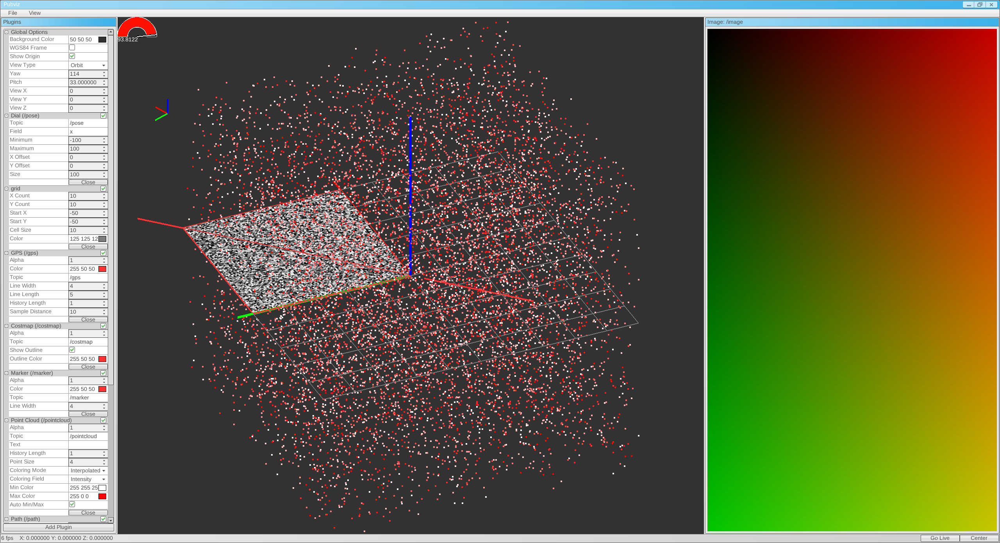
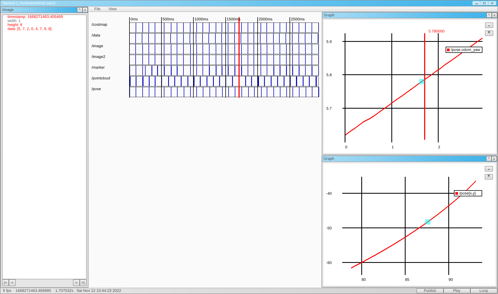

# Pubviz: Tools for Visualizing PubSub Data

Contains GWEN-based GUIs for visualizing data from the pubsub message passing library (aka middleware).

This repository contains three tools:
* Pubviz: For live data
* Sackviz: For recorded data
* CANviz (WIP): For CANbus data

# Pubviz

A tool for visualizing incoming data in both 2D and 3D. Largely uses immediate mode OpenGL for rendering for ease of implementation.

It supports visualizing:

* Point Clouds
* Costmaps
* Basic Markers (to be further improved)
* Grids
* Images
* Time series plots of individual data fields
* Gauges
* Poses
* GPS measurements

# Sackviz

A tool for introspecting and playing back Rucksack files. Also supports both time series and scatter plots of data.

# CANviz

A work in progress tool for introspecting and decoding live CANbus data. Not yet functional.

